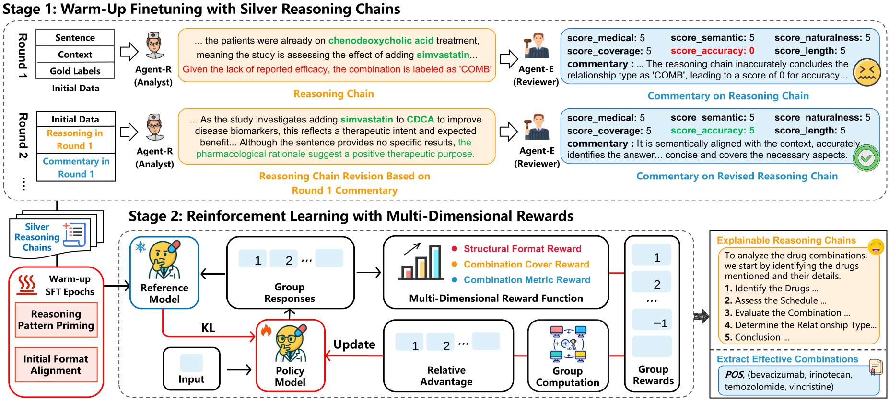

# RexDrug: Reliable Multi-Drug Combination Extraction through Reasoning-Enhanced LLMs

## 📑 Contents
- [📕 Overview](#-overview)
- [⚙️ Installation](#️-installation)
- [🔖 Data Construction](#-data-construction)
- [🚀 Training](#-training)
  - [1. Warm-Up Finetuning with Silver Reasoning Chains](#1-warm-up-finetuning-with-silver-reasoning-chains)
  - [2. Reinforcement Learning with Multi-Dimensional Rewards](#2-reinforcement-learning-with-multi-dimensional-rewards)
- [🧑‍🎓 Evaluation](#-evaluation)
- [📚 References](#-references)
## 📕 Overview
Drug Combination Extraction (DCE) aims to automatically identify the efficacy of drug combinations from biomedical literature. This task involves extracting variable-length n-ary relations between multiple drugs, which can support complex real-world treatment planning and clinical decision-making. However, most existing biomedical relation extraction methods focus primarily on binary relations and lack high-quality annotated reasoning chains, which limits the progress of multi-drug extraction and hinders clinical interpretability. To address these challenges, we propose RexDrug, an end-to-end n-ary drug combination extraction framework based on large language models and enhanced with reinforcement learning integrate reasoning capabilities. In this framework the model is first trained with silver-standard reasoning chains generated through a multi-agent collaboration strategy. Subsequently, multi-dimensional reward functions are designed to further improve both the quality of the reasoning chains and the accuracy of drug combination extraction. We evaluate RexDrug on both the n-ary DCE task and the traditional binary drugdrug interaction extraction task. Experimental results show that RexDrug consistently generates high-quality, traceable reasoning explanations and outperforms other state-of-the-art approaches, demonstrating its reliability and potential in clinical applications.



## ⚙️ Installation
```
conda create -n RexDrug python=3.11
conda activate RexDrug

# install torch [or you can skip this step and let vllm to install the correct version for you]
pip install torch==2.5.1
# install vllm
pip install vllm==0.7.2
pip install transformers==4.49.0

# flash attention 2
pip install flash-attn --no-build-isolation
pip install setuptools

# open-r1 & llamafactory
cd scr/open-r1
pip install -e .
cd scr/SFT
pip install -e ".[torch,metrics]" --no-build-isolation

```
If you encounter any issues during environment setup, please refer to the following documentation for detailed guidance:

- [LlamaFactory Documentation](https://github.com/hiyouga/LLaMA-Factory)  
- [Open-R1 Documentation](https://github.com/huggingface/open-r1)  

We would like to express our special thanks to both open-source projects for their valuable support in the model training process of this project.

## 🔖 Data Construction
We utilized two datasets, **DrugComb** and **DDI13**, for building the training data of this project.  

The original datasets can be found at:  
- [DDI13_ord](./dataset/ord_data_DDI13)  
- [DrugComb_ord](./dataset/ord_data_DrugComb/)  

After preprocessing, the datasets were transformed into the following formats:  
- [DDI13_sft](./dataset/sft_data_DDI_no_cot/)  
- [DrugComb_sft](./dataset/sft_data_DrugComb_no_cot/)  

Furthermore, we employed a multi-agent framework consisting of **Analyst** and **Reviewer** to generate silver-standard reasoning chain data for RexDrug.  
The implementation details of these agents can be found in [agents](./ReasoningGen/agents.py)

## 🚀 Training
### 1. Warm-Up Finetuning with Silver Reasoning Chains
We first employ the **llamafactory** framework to perform a warm-up finetuning stage using the silver-standard reasoning chain data generated by the multi-agent framework.
```
llamafactory-cli train ./scr/SFT/train/qwen_only_cot.yaml
```
During this stage, the resulting adapter is merged back into the base model. You are free to adopt any open-source LLM as the foundation for this training step.

### 2. Reinforcement Learning with Multi-Dimensional Rewards
The warm-up model then serves as the initialization for reinforcement learning. We employ the **open-r1** framework to conduct GRPO-based reinforcement learning.
```
bash ./scr/open-r1/recipes/rexdrug_train/train.sh
```
To enhance the model’s ability in multi-relational extraction and to encourage the generation of high-quality reasoning chains, we design task-specific, multi-dimensional reward functions tailored for this objective.

## 🧑‍🎓 Evaluation
Please see [eval](./eval/) for details about the evaluation scripts.
## 📚 References
If you use our repository, please cite the following related paper:
> @article